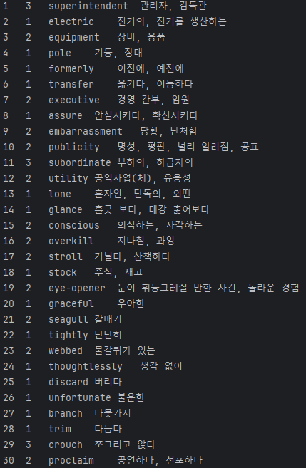
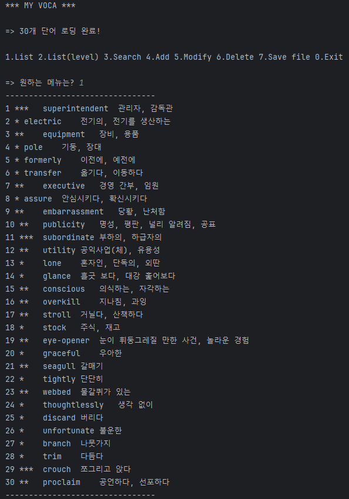
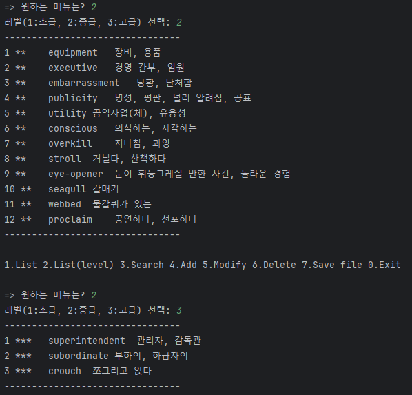
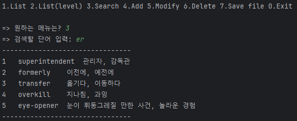
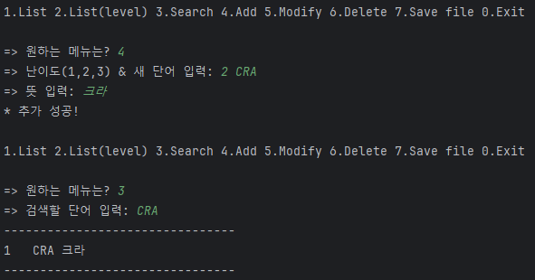
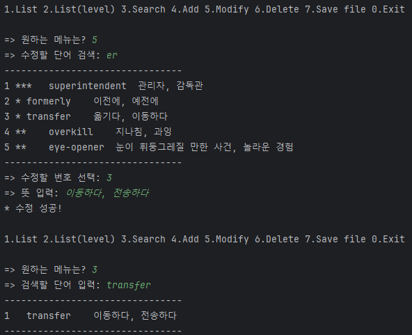
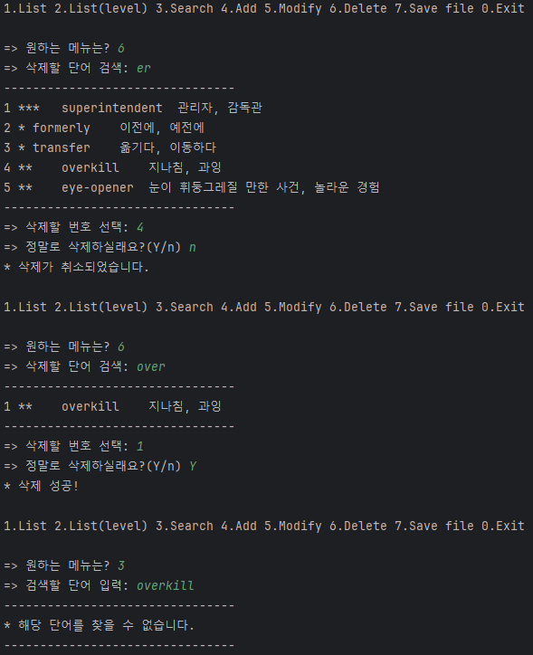
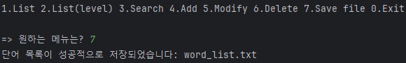

## 웹 서비스 개발 Project 1-1. Java CRUD project with file I/O
### 민경빈 (22300265)
#### 영어 단어 관리기 프로그램
텍스트 파일 예시: 
 

1번 기능 (List) 
 

2번 기능 (List by level) 
 

3번 기능 (Search) 
 

4번 기능 (Create) 
 

5번 기능 (Update) 
 

6번 기능 (Delete) 
 

7번 기능 (Save to File) 
 

