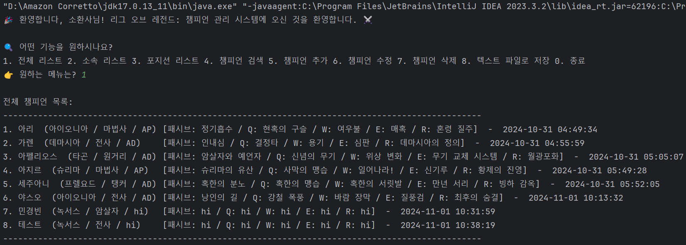
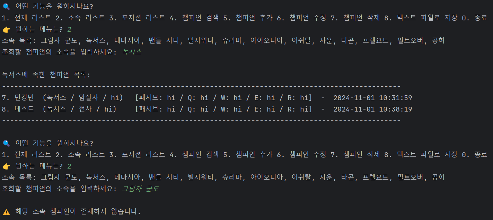
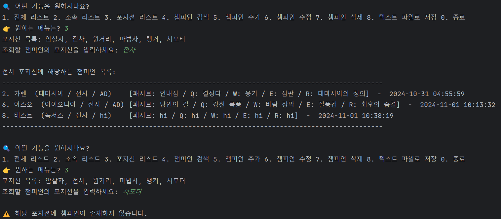
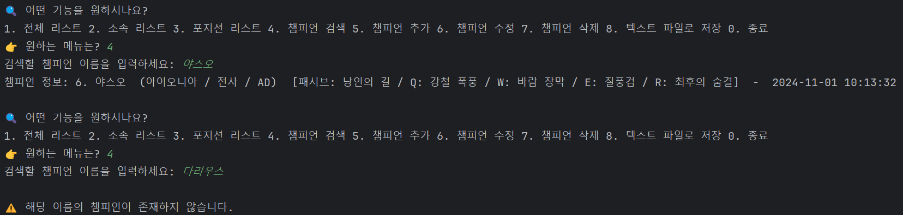
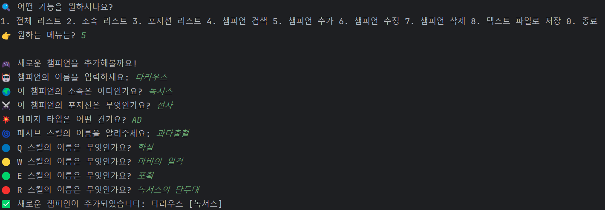
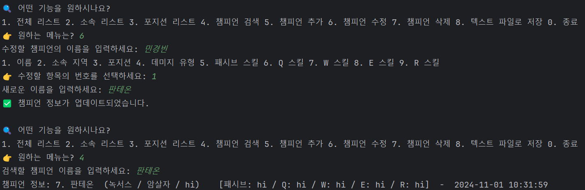
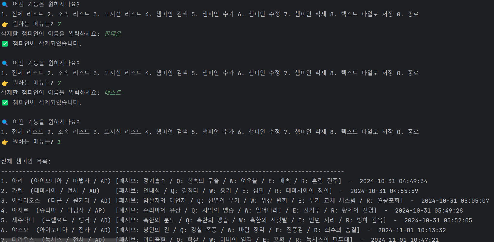
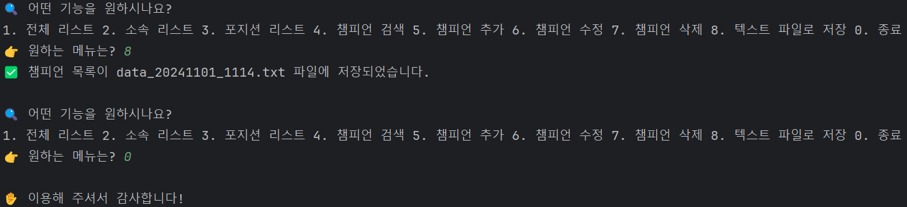
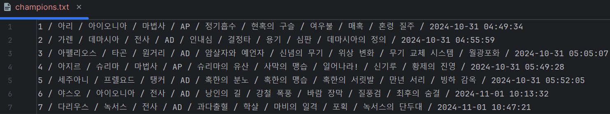
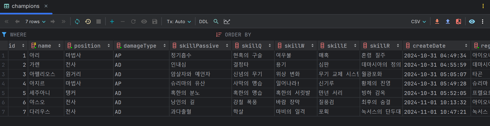

# 웹 서비스 개발 Project 1-2: Java CRUD Project with SQLite

### 프로젝트 개요
- **제작자:** 민경빈 (22300265)
- **프로젝트:** League of Legends 챔피언 CRUD 프로그램 (SQLite 활용)
- **설명:** Java로 구현된 챔피언 정보 CRUD 프로그램으로, 챔피언 정보를 조회, 생성, 업데이트, 삭제할 수 있습니다. SQLite 데이터베이스를 사용하여 정보 저장과 불러오기를 효율적으로 관리합니다.

---

## 주요 기능

1. **List** - 모든 챔피언 정보를 리스트로 출력합니다.
   

2. **List by Region** - 챔피언의 지역별로 목록을 조회할 수 있습니다.
   

3. **List by Position** - 챔피언의 포지션별로 목록을 조회할 수 있습니다.
   

4. **Search** - 챔피언의 이름을 검색하여 정보를 조회합니다.
   

5. **Create** - 새로운 챔피언 정보를 추가합니다.
   

6. **Update** - 기존 챔피언 정보를 수정합니다.
   

7. **Delete** - 선택한 챔피언 정보를 삭제합니다.
   

8. **Save to Text File** - 모든 챔피언 정보를 텍스트 파일로 저장합니다.
   

---

## 최종 결과물
- **텍스트 파일**에 저장된 챔피언 정보:
  

- **SQLite 데이터베이스**에 저장된 챔피언 정보:
  

---

